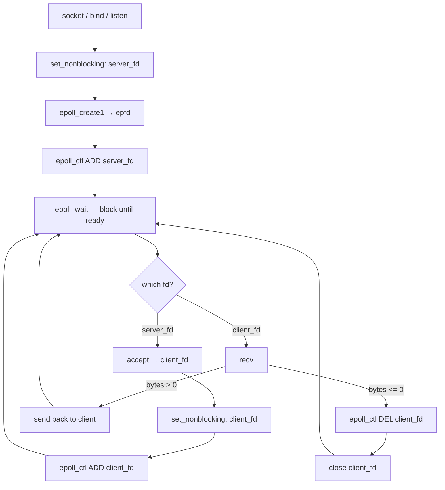

# epoll Server



## How it works

**Setup (runs once)**
1. Create and bind the listening socket as normal
2. `set_nonblocking(server_fd)` — prevents any single fd from blocking the whole process
3. `epoll_create1(0)` — creates an epoll instance, returns a file descriptor (`epfd`) that represents it
4. `epoll_ctl(ADD, server_fd)` — tells epoll "watch this fd for incoming data (`EPOLLIN`)"

**The loop**
`epoll_wait()` blocks until at least one registered fd has something to do, then returns how many are ready. You iterate over those `n` events.

**Case 1 — event on `server_fd`**
A new client is knocking. Call `accept()` to get their `client_fd`, make it non-blocking, then `epoll_ctl(ADD, client_fd)` to register it. Now epoll watches it too. Loop back to `epoll_wait`.

**Case 2 — event on a `client_fd`**
An existing client sent data. `recv()` reads it. If bytes > 0, echo it back with `send()`. If bytes == 0 (clean close) or -1 (error), `epoll_ctl(DEL)` unregisters it and `close()` it.

**The key insight**
The thread never blocks waiting on any one client. `epoll_wait` is the *only* blocking call — and it unblocks as soon as *any* fd is ready. One thread handles hundreds of clients because it's never sitting idle inside a `recv()` waiting for a slow client.
```
