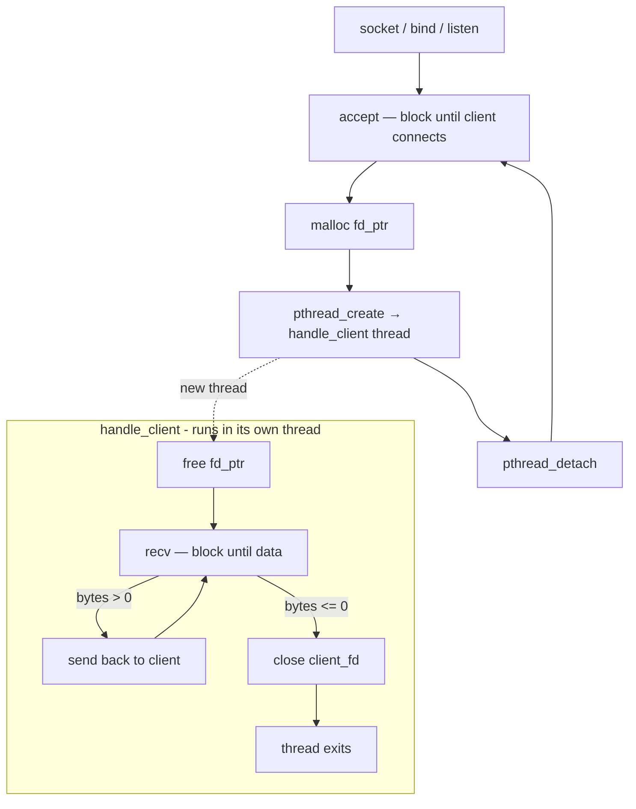

# Threaded Server

## How it works

**Setup (runs once)**
1. Create, bind, and listen on the server socket as normal
2. No non-blocking needed — each thread is allowed to block independently

**The accept loop (main thread)**
`accept()` blocks until a client connects. Once one arrives, the fd is heap-allocated into `fd_ptr` and passed to a new thread via `pthread_create()`. `pthread_detach()` tells the OS to clean up the thread automatically when it finishes — no need to call `pthread_join()`. The main thread immediately loops back to `accept()` and waits for the next client.

**`handle_client` (one per client, runs in its own thread)**
The thread owns this client for its entire lifetime. It sits in a `recv()` loop — blocking is fine here because blocking only stalls *this* thread, not others. When `recv()` returns 0 or -1, the client is gone, so it closes the fd and returns, ending the thread.

**The key insight**
Simplicity comes at a cost. Each thread consumes ~8MB of stack by default. At 1000 concurrent clients that's 8GB of virtual memory, plus the OS overhead of context-switching between all those threads. The threads spend most of their time blocked in `recv()` — the CPU isn't doing useful work, it's just sleeping in many places at once.
